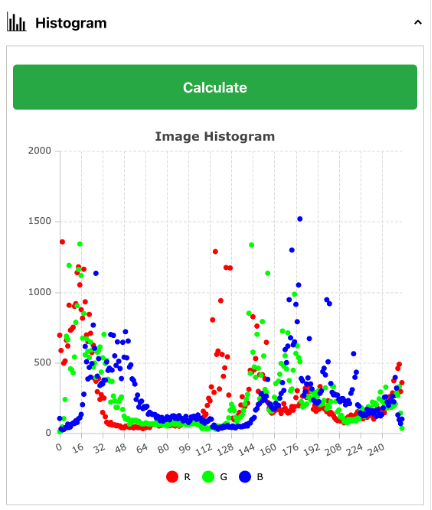
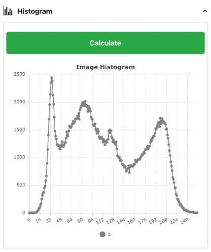
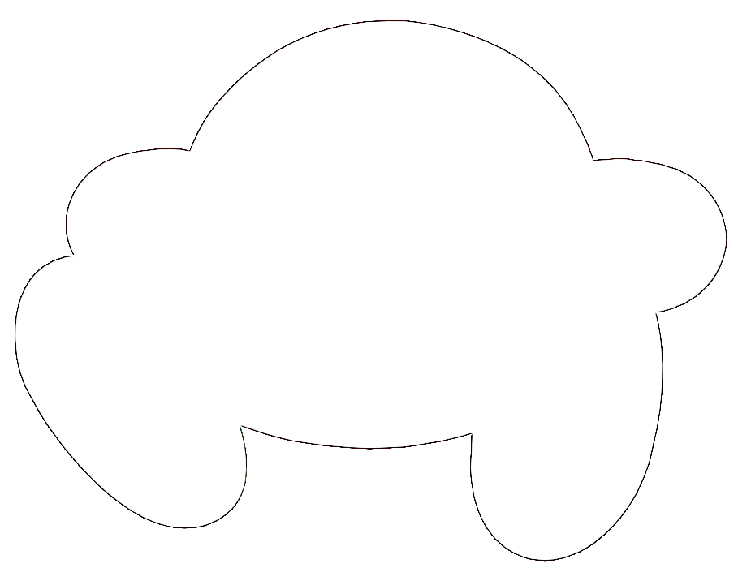
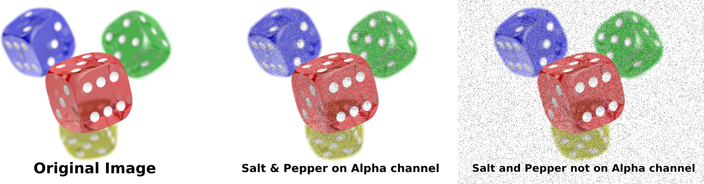

# RIPLab
Rafael's Image Processing Labratory. Final project for CIS*4720 Image Processing and Vision.

A full-stack web application and RESTful API that allows users to adjust your images, apply	filters, and perform complex image processing tasks. All image manipulation functionality is built from first principles.

**Backend:** Python, Flask, SQLite<br>
Handles the image manipulation, API calls, and CRUD webapp functionality

**Frontend:** TypeScript, React, NPM, Yarn, Node.JS<br>
The pretty interface that you interact with


## Installation
Download the repo from GitHub and download the necessary libraries

```
git clone https://github.com/rafaelwi/riplab
cd riplab
npm start
cd api
pip install -r requirements.txt
flask run
```

The frontend of the application can be accessed at `localhost:3000`<br>
The backend of the application can be accessed at `localhost:4720`


## Features
- Image cropping
- Vertically and horizontally flip an image
- Scale images with through nearest neighbour or bilinear interpolation
- Rotate an image
- Linear and exponential mapping of each pixel
- Per-channel histogram calculations
- Histogram equalization
- Convolution kernel filtering
- Salt and pepper noise
- Non-linear filtering
- Vertical and horizontal shearing


## Screenshots and Cool Examples
Here are some screenshots and examples of what RIPLab can do. This is not an exhausive list, nor the limitations of what is capable, but just some things that I thought were interesting:




*Histograms display differently based on the number of colour channels present in the image*




*Using an edge detection kernel like [-1 -1 -1] [-1 8 -1] [-1 -1 -1] on an image with a transparent background will give you its outline. This is a function that's quite easy to do with code but quite hard to do in a proper image editor like Photoshop*


*Histogram equalization can produce some serene imagery, bringing out the darker parts of an image. luh calm fit*



*Salting and peppering, among other functions, can be applied with or without the alpha channel in mind. This can create some interesting features, such as the edges of the dice in the centre image having translucent noise*
